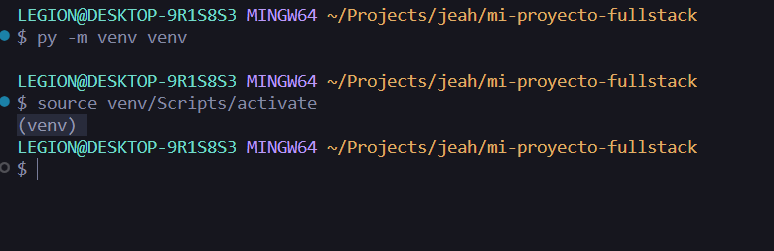
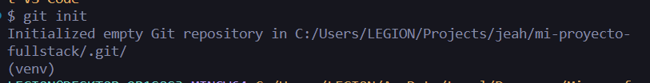

# Creando una app fullstack desde cero
## 1. Crear el directorio
```bash
mkdir my-project
``` 

## 2. Entrar en el directorio
```bash
cd my-project
``` 

Ahora debemos preguntarnos, ¿qué tecnologías llevará nuestra app?
Como en este caso vamos a hacer una aplicación web fullstack, debemos escoger un servidor y un cliente.

Para este proyecto usaremos las siguientes tecnologías:
- Servidor: **FastAPI** (Python)
- Cliente: Vite + React (Javascript)
- Base de datos:  Supabase ( PostgreSQL )

Empecemos con el servidor.
Para iniciar un proyecto de Python, es recomendable usar un **entorno virtual**, de esta forma, 
las librerías que se instalen lo harán dentro de este entorno virtual y no en todo el sistema (computadora).

Dos opciones: **pipenv** | **pip** + **venv**

Para efectos de este proyecto usaremos **pip** + **venv**: Ventajas: Viene por defecto con Python y es más rápido.

## 3. Iniciemos el entorno virtual.
```bash
py -m venv venv
``` 


Este comando iniciará un entorno virtual en el directorio donde se ejecutó el comando. Notarás que se crea un directorio **/venv** dentro del directorio **root** de nuestro proyecto.

Pero no basta con crearlo, debemos **activarlo** para que pip instale las librerías dentro del mismo.

## 4. Activar el virtual environment (venv)
```bash
source venv/Scripts/activate
``` 
Este comando puede variar según el sistema operativo (OS) del computador donde se ejecuta el proyecto.


Nota que ahora en la terminal aparece un aviso de que el venv ha sido activado.

## 5. Ahora es momento de empezar a instalar los frameworks y librerías que vayamos a usar. Empecemos por FastAPI
Para instalar una librería con pip basta con ejecutar el siguiente comando
```bash
pip install [package-name]
``` 
En este caso:
```bash
pip install fastapi
``` 

Cuando usas **pip** no mantienes un historial de lo que instalas en tu proyecto. Es por esto que suele crearse un archivo **requirements.txt** (que podría llamarse como sea) para guardar allí las librerías instaladas y sus versiones. Para hacerlo usamos el siguiente comando:

```bash
pip freeze > requirements.txt
``` 

Entonces empecemos a codear. 💪🏻

## 6. ¿Cómo iniciar un servidor básico de FastAPI?
Preguntémosle al Chayo
```txt
PROMPT: Por favor completa el paso 6 de mi documentacion y dame un archivo main.py con un servidor básico de FastAPI con una ruta
```
Creemos un archivo main.py y añadimos el código dado por el Chayo o consultado en la documentación de FastAPI [TODO: Agregar link]


```main.py
# Importamos la clase FastAPI del módulo fastapi
from fastapi import FastAPI

# Creamos una instancia de la aplicación FastAPI
app = FastAPI()

# Definimos una ruta GET para la raíz del servidor
@app.get("/")
# Definimos la función que se ejecutará cuando se acceda a la ruta raíz
def read_root():
    # Retornamos un diccionario con un mensaje de saludo
    return {"Hello": "World"}

```


## 7. ¿Cómo servir nuestra app?
Para poder servir nuestr aplicación, necesitamos un servidor asíncrono que la despliegue en un puerto de la computadora de origen. En este caso vamos a usar Uvicorn [TODO: agregar link docs]

Instalamos `uvicorn` porque es un servidor ASGI (Asynchronous Server Gateway Interface) que nos permite ejecutar aplicaciones web desarrolladas con frameworks como FastAPI. `uvicorn` es ligero y rápido, ideal para manejar aplicaciones asíncronas y de alto rendimiento. En resumen, `uvicorn` se encarga de servir nuestra aplicación FastAPI, permitiendo que podamos acceder a ella a través de un navegador web o realizar peticiones HTTP.

Instala uvicorn con:
```bash
pip install uvicorn
```

Luego de instalado, deberíamos poder ejecutar el comando:
```bash
uvicorn main:app --reload
```

> TIP: Podemos agregarle  una estructura como la siguiente:
```python
if __name__ == "__main__":
    uvicorn.run(app, host="127.0.0.1", port=8000)
```
Para ejecutar más rápido nuestra app tan solo usando:
```bash
python main.py
```

[//]: # (Revisar las demás cosas que se hicieron hasta este punto)

## 8. Ahora vamos a hacer una aplicación de cliente
Y servirla desde nuestro servidor de FastAPI usando archivos estáticos.

Para esto iniciemos una aplicación de frontend dentro del directorio /client

```bash
npm create vite client
```

Ahora instala las dependencias como debería decirte la terminal:
```bash
npm i
```

Y ejecuta el servidor de desarrollo del cliente
```bash
npm run dev
```

## 9. Los pasos hechos en el frontend para hacer los componentes iniciales y el enrutador no están anotados, pero debes saber lo siguiente:
- Directorio: El directorio principal donde estamos almacenando los archivos del frontend es `/client`

- `/client/dist`: Cuando le haces `build` con `npm run build` a tu aplicación de frontend, se actualiza el directorio `/client/dist`, ViteJs se encarga de hacerlo por ti.

- Despliegue: El servidor está desplegando el directorio `/client/dist` en la ruta `/` de tu aplicación de FastAPI. Es decir, la ruta `/` "monta" un directorio que contiene varios archivos y lo interpreta como una página web de cliente.

- Modificar rutas: Basta con modificar el enrutador "router" del archivo `/client/src/app.jsx` según [la documentación de React Router Dom v6](https://reactrouter.com/en/main/routers/create-browser-router)

## 10: Siguientes pasos
- [ ] Modificar la UI (User Interface: Interfaz de usuario) para que se vea similar a como quieres
- [ ] Agregar las rutas necesarias a la aplicación


## EXTRA: Subiendo el repo local a Github
1. Crear un repo en tu Github
2. Copiar el url, en mi caso: `https://github.com/Charlytoc/fullstack-fastapi-vite-js-template.git`
3. Inicar un repositorio local con git
Abre una nueva terminal en el root de tu proyecto y ejecuta:
```bash
git init
```


4. Agrega el repositorio en la nube previamente creado 
```bash
git remote add origin url-de-tu-repo.git
```
5. Haz un commit a tu repo
- Agrega los archivos que quieras al staging
El siguiente comando agrega todos los archivos:
```bash
git add .
```

- Escribe un commit message
```bash 
git commit -m "Mensaje de los cambios de tu commit"
```

- Haz un push a tu repo en la nube
```bash
git push origin master
```
El último paso puedes simplificarlo con `git push`.


### Enlaces adicionales
- [Documentación de FastAPI](https://fastapi.tiangolo.com/)
- [Documentación de Uvicorn](https://www.uvicorn.org/)
- [Documentación de React Router Dom v6](https://reactrouter.com/en/main/routers/create-browser-router)
